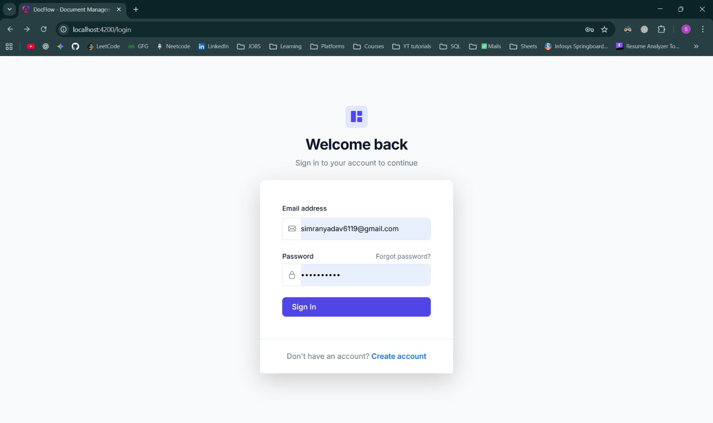
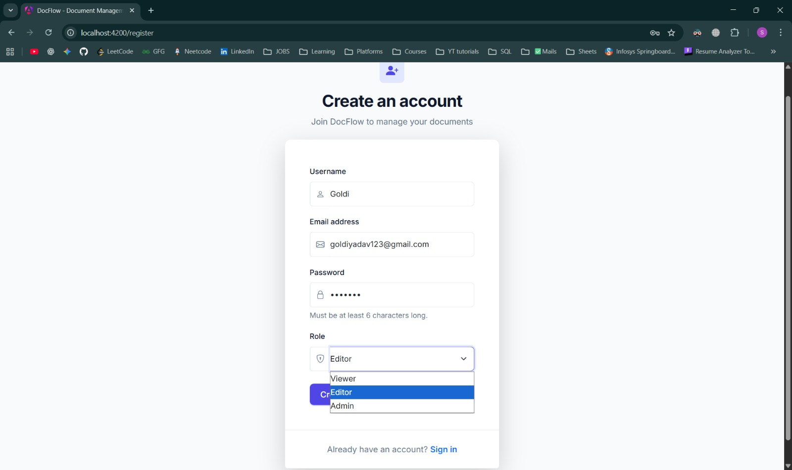
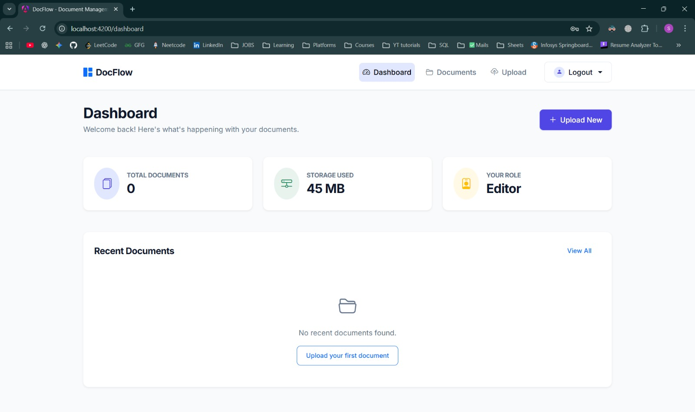
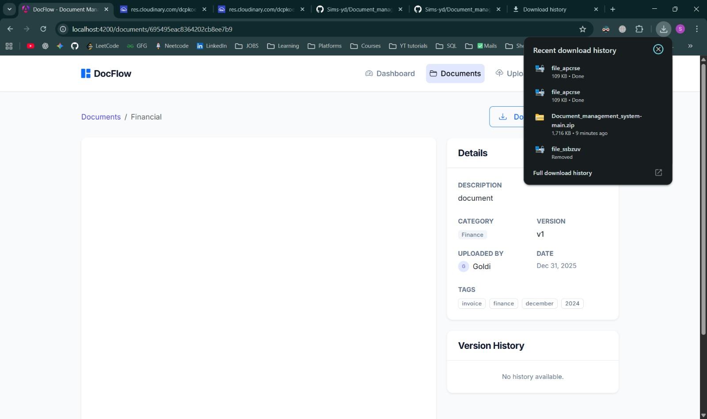
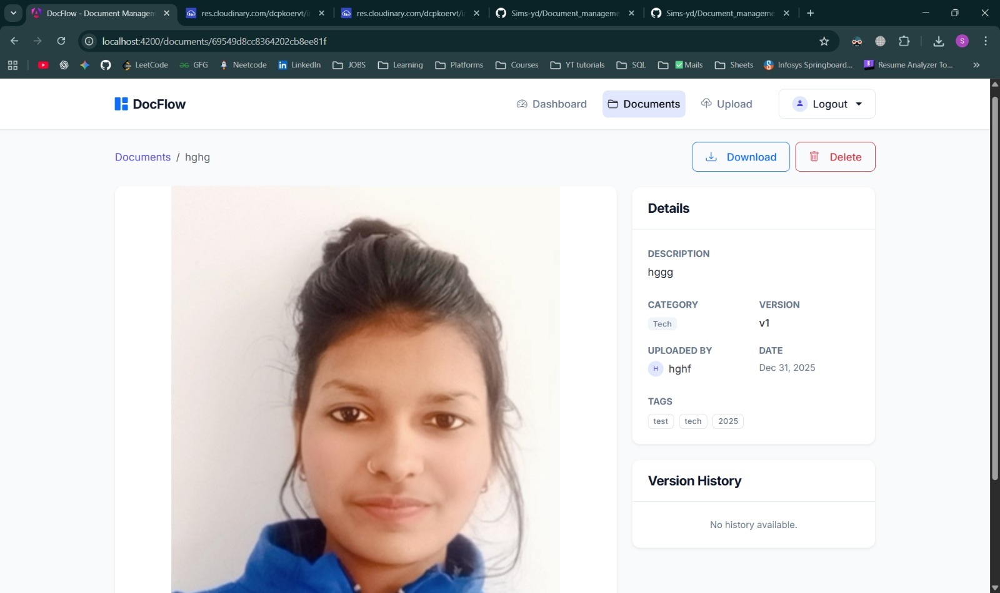
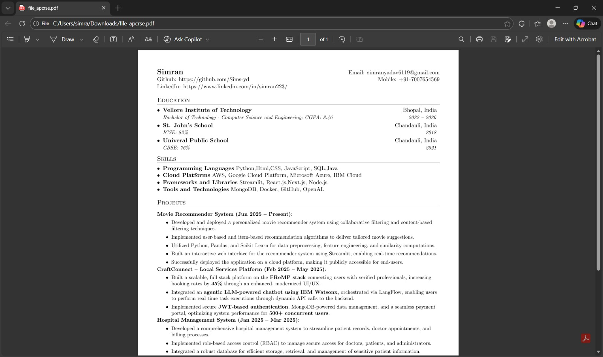
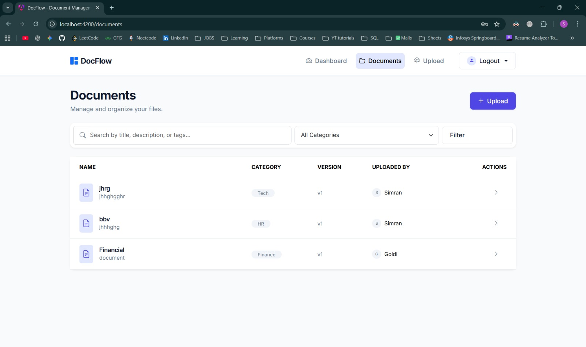
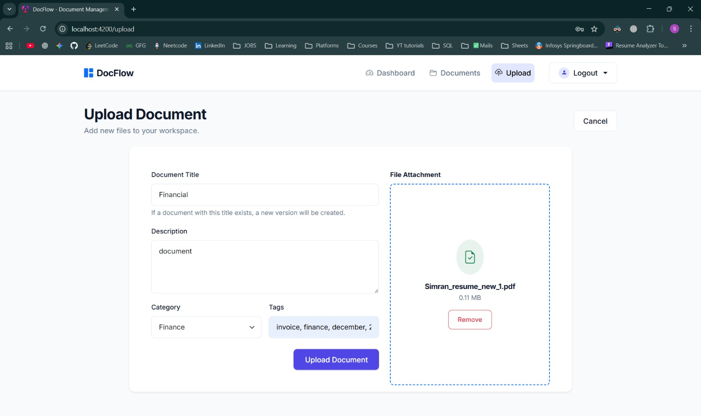

# Document Management System

End-to-end document library with user roles, uploads to Cloudinary, Firebase storage bucket bootstrap, and Angular 21 frontend.

## Features
- Role-based access (`Admin`, `Editor`, `Viewer`) with JWT auth
- Upload, list, version, view, and delete documents
- Cloudinary-backed file storage and basic version history
- Angular dashboard for browsing, detail view, and uploads
- MongoDB persistence via Mongoose

## Tech Stack
- Backend: Node.js, Express, MongoDB/Mongoose, JWT, Cloudinary, Multer
- Frontend: Angular 21, Bootstrap 5
- Storage: Cloudinary (files), Firebase bucket bootstrap (optional hook)

## Project Structure
```
backend/   Express API, auth, document routes
frontend/  Angular SPA
```

## Prerequisites
- Node.js 18+
- npm 9+
- MongoDB instance
- Cloudinary account (cloud name, API key/secret)
- Firebase service account JSON (for `backend/serviceAccountKey.json`), bucket name

## Backend Setup
1) Install deps
```bash
cd backend
npm install
```
2) Create `.env` in `backend/`
```bash
PORT=5000
MONGO_URI=mongodb://localhost:27017/dms
JWT_SECRET=change_me
CLOUDINARY_CLOUD_NAME=your_cloud_name
CLOUDINARY_API_KEY=your_api_key
CLOUDINARY_API_SECRET=your_api_secret
FIREBASE_STORAGE_BUCKET=your-bucket.appspot.com
```
3) Add your Firebase service account JSON to `backend/serviceAccountKey.json`.
4) Run the API
```bash
# development reload
npm run dev
# or production
npm start
```
API will listen on `http://localhost:5000`.

## Frontend Setup
1) Install deps
```bash
cd frontend
npm install
```
2) Start dev server (Angular CLI)
```bash
npm start
```
App runs at `http://localhost:4200` (proxy API base URL if needed via Angular environment or interceptor).

## Key API Routes
- `POST /api/auth/register` — create user
- `POST /api/auth/login` — get JWT
- `POST /api/documents/upload` — upload/update document (roles: Editor, Admin)
- `GET /api/documents` — list documents (optional `keyword`, `category`)
- `GET /api/documents/:id` — get one; `GET /api/documents/:id/history` — version history
- `DELETE /api/documents/:id` — delete (role: Admin)

## Testing
- Frontend unit tests: `cd frontend && npm test`

## Environment Notes
- File uploads use Cloudinary via `multer-storage-cloudinary`; supported formats: jpg, png, pdf.
- Versioning stores prior file URLs in `history` on title collisions during upload.
- JWT Bearer tokens are required on protected routes via `Authorization: Bearer <token>`.

## Screenshots

### Login


### Register


### Dashboard


### Upload Page


### Document Uploaded


### Uploaded Image


### Uploaded File


### All Document Created


### Add Credentials


